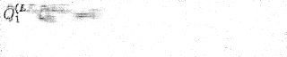
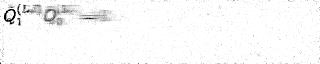

# Markup-to-Image Diffusion Models with Scheduled Sampling

We provide code to reproduce our results on markup-to-image generation. Our code is built on top of HuggingFace [diffusers](https://github.com/huggingface/diffusers) and [transformers](https://github.com/huggingface/transformers).

## Online Demo: [https://huggingface.co/spaces/yuntian-deng/latex2im](https://huggingface.co/spaces/yuntian-deng/latex2im).

## Generation Examples

Scheduled Sampling            |   Baseline
:----------------------------:|:---------------------------------------:
  |  


## Prerequisites

* [Pytorch](https://pytorch.org/get-started/locally/)

```
pip install transformers
pip install -qU git+https://github.com/da03/diffusers
```

## Datasets & Pretrained Models

All datasets have been uploaded to [Huggingface datasets](https://huggingface.co/yuntian-deng).

* Math: [data]() [model]()
* Simple Tables: [data]() [model]()
* Sheet Music: [data]() [model]()
* Molecules: [data]() [model]()

## Usage

### Training


### Generation

### Visualizations

#### Math

To visualize the generation process, we need to first use the following command to save the intermediate images during generation:

```
python scripts/visualize_intermediate_steps.py --model_path models/math/scheduled_sampling/model_e100_lr0.0001.pt.100 --output_dir outputs/math/scheduled_sampling_visualization --save_intermediate_every 1
```

Next, we put together a gif image from the generated images:

```
python scripts/make_gif.py --input_dir outputs/math/scheduled_sampling_visualization/ --output_filename imgs/math_rendering.gif --filter_filename 433d71b530.png --show_every 10
```

We can similarly visualize results from the baseline.

```
python scripts/visualize_intermediate_steps.py --model_path models/math/baseline/model_e100_lr0.0001.pt.100 --output_dir outputs/math/baseline_visualization --save_intermediate_every 1
```

```
python scripts/make_gif.py --input_dir outputs/math/baseline_visualization/ --output_filename imgs/math_rendering_baseline.gif --filter_filename 433d71b530.png --show_every 10
```

#### Tables

To visualize the generation process, we need to first use the following command to save the intermediate images during generation:

```
python scripts/visualize_intermediate_steps.py --dataset_name yuntian-deng/im2html-100k --model_path models/tables/scheduled_sampling/model_e100_lr0.0001.pt.100 --output_dir outputs/tables/scheduled_sampling_visualization --save_intermediate_every -1
```

Next, we put together a gif image from the generated images:

```
python scripts/make_gif.py --input_dir outputs/math/scheduled_sampling_visualization/ --output_filename imgs/math_rendering.gif --filter_filename 433d71b530.png --show_every 10
```

We can similarly visualize results from the baseline.

```
python scripts/visualize_intermediate_steps.py --dataset_name yuntian-deng/im2html-100k --model_path models/tables/baseline/model_e100_lr0.0001.pt.100 --output_dir outputs/tables/baseline_visualization --save_intermediate_every -1
```

```
python scripts/make_gif.py --input_dir outputs/math/baseline_visualization/ --output_filename imgs/math_rendering_baseline.gif --filter_filename 433d71b530.png --show_every 10
```

## Citation

```
@misc{deng2022markuptoimage,
      title={Markup-to-Image Diffusion Models with Scheduled Sampling}, 
      author={Yuntian Deng and Noriyuki Kojima and Alexander M. Rush},
      year={2022},
      eprint={2210.05147},
      archivePrefix={arXiv},
      primaryClass={cs.LG}
}
```
